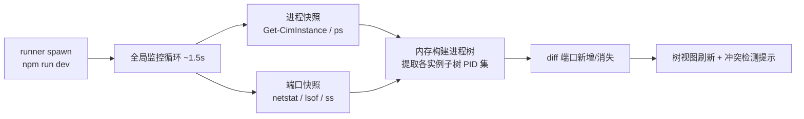

## 产品概述

npm-run 是一个面向 VSCode/CodeBuddy 的扩展插件，提供可视化的 npm 脚本运行管理面板。自动扫描工作区内所有 npm 项目（含 monorepo 子包），将运行脚本按项目分组展示在侧边栏树形列表中，支持一键运行，并实时追踪该脚本启动的每一个端口级服务。

## 核心功能

- **项目扫描**：递归扫描工作区全部 package.json（自动排除 node_modules/dist 等），按项目分组展示 scripts
- **一键运行**：脚本行右侧提供运行按钮，运行输出实时显示在输出面板；同一脚本运行中再次点击会提示先停止
- **多端口服务追踪**：脚本运行后自动发现其进程树启动的全部监听端口，作为服务子节点挂到该脚本下，端口出现/消失实时增删
- **服务管理**：服务节点显示 IP+端口，可单独结束某一个端口服务（同脚本的其他服务不受影响）
- **端口冲突处理**：脚本因端口被占报错时，识别占用端口的外部进程并弹窗提示，提供一键结束占用进程
- **本地安装验证**：产出标准 .vsix 包供本地安装验证，架构保持后续上架商店的兼容性

**界面结构**（侧边栏活动区树视图）：项目节点 → 脚本节点（左侧脚本名，右侧行内运行/停止按钮）→ 服务节点（IP:端口，右侧行内结束按钮），运行中的脚本显示旋转加载图标。

## 技术栈

- **语言/框架**：TypeScript 5 + VSCode Extension API（`engines.vscode: ^1.85.0`，向下兼容 CodeBuddy，标准 VSIX 三端通用）
- **构建**：esbuild 打包为单文件 CJS（现代扩展主流方案，快且产物小）
- **打包**：@vscode/vsce → `.vsix`
- **测试**：Mocha 单元测试（纯逻辑模块，可脱离 VSCode 运行）+ F5 扩展开发宿主全链路验证
- **零运行时 npm 依赖**：进程/端口探测全部自实现，避免依赖膨胀

## 实现方案

### 总体策略

激活时扫描项目构建树视图；点击运行由扩展直接 spawn 进程（win32 下 `npm.cmd` + `shell:true`）并接管 stdout/stderr 流入按实例命名的 OutputChannel。**全局单例监控循环**（仅在有脚本运行期间活跃）每 ~1.5s 执行两次系统快照：进程快照（Windows `Get-CimInstance Win32_Process`，wmic 已在新系统移除；macOS/Linux `ps`）+ 端口快照（Windows `netstat -ano`，macOS `lsof -i -P -n`，Linux `ss -tlnp`），在内存中合并后按各运行实例的进程子树 diff 出端口增删，驱动树视图刷新与冲突提示。

### 关键决策与理由

1. **扩展自管理进程而非 Terminal API**：端口级结束的前提是持有进程树根 PID，Terminal API 无法可靠获取。
2. **全局单监控循环而非每实例轮询**：N 个脚本运行时仅 1 组快照调用、进程表复用，开销 O(进程总数) 而非 O(N×进程总数)。
3. **解析器纯函数化**（netstat/lsof/ss 解析、进程树构建、端口 diff 均无副作用）：本项目最大风险点（跨平台输出格式）前置到可单测的纯逻辑层。
4. **单实例策略**：同一脚本同时只允许一个运行实例（YAGNI，避免多实例 UI 与归属复杂度）。
5. **冲突务实方案**：无法预知脚本将占用哪个端口；通过解析输出中的 `EADDRINUSE` 等报错提取端口号，反查实际占用 PID，若为外部进程则弹通知并提供“结束占用进程”操作。
6. **结束单服务机制**：端口→PID→若属于子树非根节点则只杀该 PID 的子树（Windows `taskkill /PID x /T /F`，Unix 递归 SIGTERM）；若监听进程就是根进程则提示需停止整个脚本。

### 检测数据流



## 目录结构

工作区为空目录，全部为新建文件：

```
d:\workspace\npm-run\
├── package.json            # [NEW] 扩展清单：activationEvents、contributes（活动栏容器 + 树视图 + 命令 + view/item/context 行内菜单 + 排除目录配置项）
├── tsconfig.json           # [NEW] TS 配置（ES2022、Node16 模块解析）
├── esbuild.js              # [NEW] 构建脚本：bundle src/extension.ts → dist/extension.js
├── .vscodeignore           # [NEW] vsce 打包排除（src/test/fixtures/vsix 等）
├── .gitignore              # [NEW] 忽略 dist/node_modules/*.vsix
├── README.md               # [NEW] 扩展说明（vsce 打包必需）
├── LICENSE                 # [NEW] MIT（vsce 提示必需）
├── media/icon.png          # [NEW] 扩展图标 128×128
├── src/
│   ├── extension.ts        # [NEW] 激活入口：装配模块、注册命令/树视图，deactivate 时清理全部托管进程防孤儿
│   ├── types.ts            # [NEW] 核心类型：NpmProject / RunningScript / ServiceInfo
│   ├── projectScanner.ts   # [NEW] findFiles('**/package.json')+排除规则，解析 scripts，监听工作区文件变更自动刷新
│   ├── runner.ts           # [NEW] spawn 运行器：托管进程表、OutputChannel 输出管道、优雅停止/强杀
│   ├── portScanner.ts      # [NEW] 纯函数：三种平台命令输出解析 → {port, address, pid}[]
│   ├── processTree.ts      # [NEW] 纯函数：进程快照 → 树构建/子树 PID 提取；平台化 tree-kill
│   ├── serviceMonitor.ts   # [NEW] 全局轮询循环：快照合并 → 按实例 diff → 服务增删事件 + EADDRINUSE 冲突检测
│   └── treeProvider.ts     # [NEW] TreeDataProvider：项目/脚本/服务节点、codicon 图标、运行中 spinner 状态
├── test/                   # [NEW] Mocha 单元测试：portScanner / processTree / projectScanner / diff 纯模块
└── fixtures/
    ├── app-a/              # [NEW] 示例项目：单脚本 node 同时起两个 http server（不同端口）
    └── app-b/              # [NEW] 示例项目：固定端口脚本（用于制造 EADDRINUSE 冲突验证）
```

## 关键类型契约

```ts
interface NpmProject {
  name: string;                     // package.json name 或目录名
  dir: vscode.Uri;                  // 项目根目录
  scripts: Map<string, string>;     // 脚本名 → 命令
}

interface RunningScript {
  project: NpmProject;
  script: string;
  rootPid: number;                  // 扩展 spawn 的根进程 PID
  services: Map<number, ServiceInfo>; // 端口 → 服务
  output: vscode.OutputChannel;
}

interface ServiceInfo {
  port: number;
  address: string;   // 监听地址（127.0.0.1 / 0.0.0.0 等）
  pid: number;       // 实际监听进程 PID
  isRoot: boolean;   // 是否为脚本根进程本身（决定能否单独结束）
}
```

## 实施注意事项

- **Windows 优先**（用户平台）：npm.cmd 需 `shell:true`，根 PID 为 cmd 包装层，端口归属判定必须基于“子树 PID 集合”而非直接子进程；杀树用 `taskkill /T` 从根杀不受包装层影响。
- **性能**：轮询仅在 ≥1 实例运行时启动、全部结束即停止单次快照 2s 超时兜底；进程表一次拉全量后在内存过滤，禁止递归逐 PID 查询。
- **日志分离**：脚本输出走按实例命名的 OutputChannel（追加写不重建）；扩展自身诊断走独立日志 channel。
- **资源清理**：脚本退出/扩展停用时必须杀全树（防孤儿端口进程），并用 `onDidCloseTerminal` 类语义确保无泄漏轮询。
- **爆炸半径**：杀外部占用进程的快捷操作必须二次确认；所有 kill 失败要回显错误而非静默。

## Agent Extensions

### Skill

- **test-driven-development**
- Purpose：对纯逻辑模块（portScanner 三平台输出解析、processTree 树构建/子树提取、端口 diff）先写失败测试再实现
- Expected outcome：核心解析与 diff 逻辑全部有单测覆盖且通过，跨平台输出格式风险前置消化
- **verification-before-completion**
- Purpose：全链路验证与 vsce 打包阶段，先运行实际命令核对结果再宣告完成
- Expected outcome：F5 验证扫描/运行/多端口/冲突/单服务结束全链路通过，`.vsix` 实际产出并本地安装成功